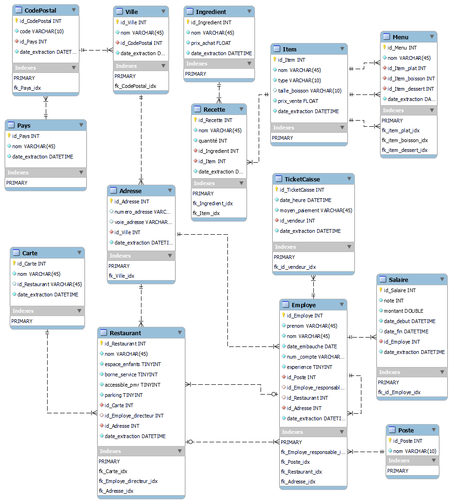

# DEVIA P3 - Projet FastFood
## Bibliothèques utilisées : Django, SQLAlchemy, Faker
### Réalisé par Elias et ZoLTaR
<br>

---
#### <b>Avant toute chose, pour utiliser ce projet, veuillez le cloner dans un dossier local de votre choix</b>
---
<br>

### 1. Creation de l'environnement et installation des dépendances

- Option 1 : génération automatique de l'environnement
```sh
# Assurez-vous d'être à la racine du projet, au même niveau que manage.py

conda deactivate
conda create --name restaurant_BI --file conda_requirements
conda activate restaurant_BI
```

- Option 2 : Génération manuelle de l'environnement minicondas
```sh
# Assurez-vous d'être à la racine du projet, au même niveau que manage.py

conda deactivate
conda create -n restaurant_BI
conda activate restaurant_BI
conda install sqlalchemy
conda install django
conda install python-dotenv
conda install faker
conda install unidecode
conda install pandas
```

### 2. Création du fichier .env avec la clé secrète Django

```sh
# Assurez-vous d'être à la racine du projet, au même niveau que manage.py

echo -n "SECRET_KEY=" > .env
python -c 'from django.core.management.utils import get_random_secret_key; print(get_random_secret_key())' >> .env
```

### Annexes : ressources complémentaires

- Diagramme UML EER (schéma logique Entités-Relations étendu)



- Script SQL pour la génération du schéma de données (version MySQL Server) => <a href="https://github.com/zoltarzol/restaurant_BI/blob/dev_cedric/create_schema_mysql.sql">create_schema_mysql.sql</a><br>

```sql
/*########################
# ...aperçu du fichier...#
########################*/

CREATE SCHEMA IF NOT EXISTS `FastFood` ;

CREATE TABLE IF NOT EXISTS `FastFood`.`Poste` (
  `id_Poste` INT NOT NULL,
  `nom` VARCHAR(10) NOT NULL,
  PRIMARY KEY (`id_Poste`))
ENGINE = InnoDB;
```

- Premiers tests avec SQLAlchemy => <a href="https://github.com/zoltarzol/restaurant_BI/blob/dev_cedric/tests_SQLAlchemy.py">tests_SQLAlchemy.py</a><br>
(script exécutable séparément, affichage des résultats en console)

```py
##########################
# ...aperçu du fichier...#
##########################

# Jointure de tables
results = session.query(Employe, Poste.nom).filter(Employe.id_Poste == Poste.id_Poste).all()
print(sep, "Jointure pour afficher le poste des employés\n", "LIGNES:", len(results), "\n")
for r in results:
    print(r[0], "occupe le poste de", r[1])
print(sep)
```
